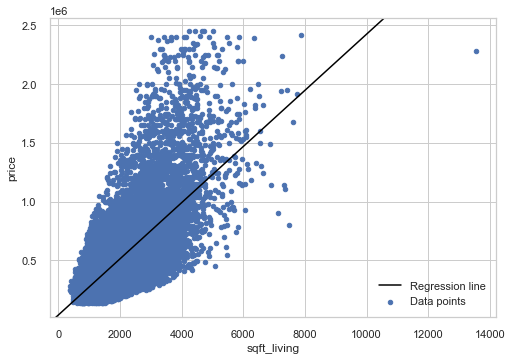

# KINGS COUNTY HOUSE PREDICTION

### Project Overview

This project leverages the King County House Sales dataset to perform a comprehensive analysis of house sales in a Northwest county using multiple linear regression modeling. Our primary aim is to empower local real estate agencies with the insights required to address inquiries, particularly from homeowners. We seek to identify the pivotal factors that significantly impact house prices and quantify the extent of their influence on property values and potential appreciation.

### Problem Statement

This project centers around the critical challenge faced by real estate agencies in King County. These agencies act as intermediaries for homeowners looking to buy or sell homes and need to navigate the intricate web of factors that impact property prices. Their primary mission is to identify key price predictors and provide data-driven insights to homeowners, guiding them in making informed decisions about home renovations. The ultimate goal is to optimize home values based on certain predictors.

### Analysis

The square footage of living space is one of the most influential factors when it comes to determining the value of a property. It was discovered that it has the highest correlation with price.

The graph below indicates that the square footage of living space is postively correlated to price, and with a better view the property becomes more expensive.

### Conclusion
From our data we can conclude that price is mainly determined by waterfront, sqft_living, grade.

Also, most houses have an average of 3 bedrooms.

For a house with an average number of bedrooms, bathrooms, sqft_living,  area, sqft_lot area, waterfront, grade, floors and condition we would expect the price to be aapproximately $528969. 

Most houses in our data are of average condition.

### Recommendation

1. Implement a pricing strategy that considers factors such as the specific location along the waterfront and any unique features of the property. Different waterfront properties may command different price points. A higher price for houses with waterfront views provides an opportunity for real estate agencies to specialize and cater to a niche market
 
 2. Encourage sellers to invest in property improvements and maintenance to increase property value. Provide guidance on home staging and presentation to attract buyers since most of the house are of average condition.

 3. Larger living spaces (sqft_living) can command higher prices. Sellers of properties with spacious living areas should emphasize this feature in listings. Buyers should prioritize properties that offer the desired living space.

 4. Buyers interested in high-quality properties should prioritize those with a higher grade. Sellers should invest in improving the grade of their properties to increase market appeal.

 ### Next Steps

1. Evaluate the limitations of multiple linear regression by comparing its performance with other regression models.

2. Supplementary data from the Kings County to further improve the model's precision.

3. More current and longer cover period data to reach a more accurate conclusion for homeowners' reference.
